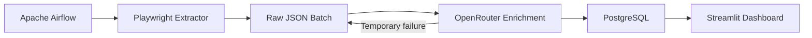

# LinkedIn Job Market Analysis

## Overview
This project collects public LinkedIn job listings, extracts complete job descriptions with Playwright, and uses an OpenRouter-compatible LLM to identify technical skills and seniority. The enriched jobs are stored in PostgreSQL. Apache Airflow handles orchestration, and Streamlit and Plotly power the dashboard. It does not provide exhaustive LinkedIn coverage.

## Architecture

Failed batches remain in raw storage. Database duplicates are checked before new LLM calls.

## Technology stack
- Python 3.10
- Apache Airflow 2.7.3
- Playwright
- OpenRouter
- PostgreSQL 15
- Docker Compose
- Streamlit
- Plotly
- Pandas

## Pipeline
The pipeline consists of two Airflow tasks:
```text
extract_jobs
→ enrich_and_load_jobs
```
The extractor writes `*_jobs.json`. The parser checks duplicates, and OpenRouter returns structured skills and seniority. Completed batches move from raw to processed, while incomplete batches remain retryable. Failed parser tasks can be retried without rerunning successful LLM work.

## Project structure
```text
airflow/dags/linkedin_data_pipeline.py
src/linkedin_market_analysis/scraper/extractor.py
src/linkedin_market_analysis/scraper/llm_client.py
src/linkedin_market_analysis/scraper/parser.py
visualization/app.py
scripts/setup.ps1
scripts/setup.sh
scripts/init-databases.sh
Dockerfile.airflow
docker-compose.yml
.env.example
```

## Prerequisites
- Docker Desktop or Docker Engine with Compose
- OpenRouter API key
- Roughly sufficient disk space for the Airflow and Playwright images

## Quick start
**Windows:**
```powershell
.\scripts\setup.ps1
```

**Linux/macOS:**
```bash
chmod +x scripts/setup.sh
./scripts/setup.sh
```

Then add your OpenRouter key to `.env`:
```bash
LLM_API_KEY=your_openrouter_key
```

Then run:
```bash
docker compose build
docker compose up -d
```
PostgreSQL automatically creates the Airflow metadata database and the `linkedin_market` application database on a fresh volume.

## Access
- Airflow: http://localhost:8880
- Dashboard: http://localhost:8501

Airflow credentials come from:
`AIRFLOW_ADMIN_USERNAME`
`AIRFLOW_ADMIN_PASSWORD`

## Running the pipeline
1. Open Airflow.
2. Find `linkedin_data_pipeline`.
3. Unpause it if necessary.
4. Trigger it manually.
5. Wait for both tasks to succeed.
6. Refresh the Streamlit dashboard.

The default extraction limit is 3 for a safe demo and can be changed through:
```bash
MAX_JOBS_TO_EXTRACT=15
```

## Dashboard
The read-only presentation layer displays:
- Total jobs
- Unique companies
- Unique technical skills
- Most common seniority
- Company filter
- Seniority filter
- Search
- Seniority chart
- Top skills chart
- Hiring-company chart
- Sanitized jobs table

## Environment variables
- `DB_HOST`: PostgreSQL hostname (Required)
- `DB_PORT`: PostgreSQL port (Required)
- `DB_NAME`: Database name (Required)
- `DB_USER`: Database user (Required)
- `DB_PASSWORD`: Database password (Required)
- `DB_PASSWORD_URI`: URL-encoded form of DB_PASSWORD (Required)
- `FERNET_KEY`: Secure key for Airflow (Required)
- `LLM_API_KEY`: OpenRouter API Key (Required)
- `LLM_BASE_URL`: Base URL for OpenRouter (Required)
- `LLM_MODEL`: Target LLM model (Required)
- `LINKEDIN_JOB_TITLE`: Job title to search (Required)
- `MAX_JOBS_TO_EXTRACT`: Limits the scraper (Required)
- `RAW_DIR`: Storage for incoming JSON batches (Required)
- `PROCESSED_DIR`: Storage for completed JSON batches (Required)
- `AIRFLOW_ADMIN_USERNAME`: Admin login username (Required)
- `AIRFLOW_ADMIN_PASSWORD`: Admin login password (Required)
- `AIRFLOW_ADMIN_FIRSTNAME`: Admin first name (Optional)
- `AIRFLOW_ADMIN_LASTNAME`: Admin last name (Optional)
- `AIRFLOW_ADMIN_EMAIL`: Admin email (Optional)

## Data safety
- `.env` is ignored
- Scraped JSON is ignored
- Airflow logs are ignored
- Descriptions and complete URLs are not displayed in the dashboard
- Database duplicates are checked before LLM calls
- Failed batches remain retryable


## Limitations
- Public LinkedIn markup may change
- Free OpenRouter models may return transient failures
- The parser preserves incomplete batches for retry
- The default batch is intentionally small
- This is an educational and portfolio project

## Reproducibility note
The complete pipeline was runtime-tested on the main local stack. Clean-install configuration and setup scripts were statically validated. A fully isolated fresh-volume execution remains recommended before a production release.
