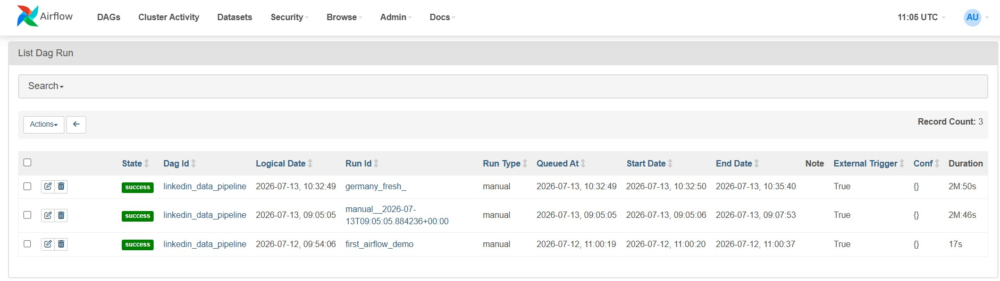
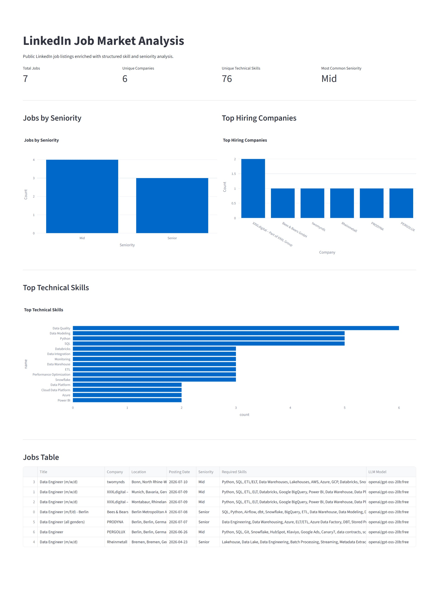
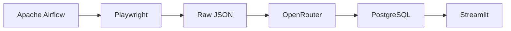

# LinkedIn Job Market Analysis

A small data pipeline for collecting and analyzing job listings from Germany.

It collects public LinkedIn job listings, finds technical skills and seniority levels, stores the results in PostgreSQL, and shows them in a Streamlit dashboard.

## Screenshots

### Airflow pipeline




### Germany job market dashboard



## How it works

The pipeline has two Airflow tasks:

```text
extract_jobs
→ enrich_and_load_jobs
```

The first task uses Playwright to collect job listings and full descriptions.

The second task checks for existing jobs, sends new jobs to an OpenRouter model, and saves the results in PostgreSQL.

When a batch is complete, its JSON file moves from the raw folder to the processed folder. Failed batches stay in the raw folder so they can be tried again.

## Architecture



## Tools

- Python 3.10
- Apache Airflow
- Playwright
- OpenRouter
- PostgreSQL
- Docker Compose
- Streamlit
- Pandas

## Project structure

```text
airflow/dags/linkedin_data_pipeline.py
src/linkedin_market_analysis/scraper/extractor.py
src/linkedin_market_analysis/scraper/llm_client.py
src/linkedin_market_analysis/scraper/parser.py
visualization/app.py
scripts/setup.ps1
scripts/setup.sh
scripts/init-databases.sh
Dockerfile.airflow
docker-compose.yml
.env.example
```

## Requirements

You need:

- Docker Desktop or Docker Engine
- Docker Compose
- An OpenRouter API key

## Setup

### Windows

```powershell
.\scripts\setup.ps1
```

### Linux and macOS

```bash
chmod +x scripts/setup.sh
./scripts/setup.sh
```

Open `.env` and add your OpenRouter key:

```env
LLM_API_KEY=your_openrouter_key
```

Then build and start the project:

```bash
docker compose build
docker compose up -d
```

On a new setup, PostgreSQL creates the Airflow database and the Germany jobs database automatically.

## Access

Airflow:

```text
http://localhost:8880
```

Streamlit dashboard:

```text
http://localhost:8501
```

The Airflow username and password are stored in `.env`:

```text
AIRFLOW_ADMIN_USERNAME
AIRFLOW_ADMIN_PASSWORD
```

## Run the pipeline

1. Open Airflow.
2. Find `linkedin_data_pipeline`.
3. Unpause it if needed.
4. Trigger a new run.
5. Wait for both tasks to finish.
6. Open the Streamlit dashboard.
7. Click **Refresh Data**.

## Search settings

The default search looks for Data Engineer jobs in Germany.

```env
LINKEDIN_JOB_TITLE=Data Engineer
LINKEDIN_LOCATION=Germany
MAX_JOBS_TO_EXTRACT=3
```

You can change the job title and extraction limit in `.env`.

For example:

```env
LINKEDIN_JOB_TITLE=Data Scientist
LINKEDIN_LOCATION=Germany
MAX_JOBS_TO_EXTRACT=10
```

After changing `.env`, recreate the Airflow scheduler:

```bash
docker compose up -d --force-recreate airflow_scheduler
```

Then trigger a new Airflow run.

## Dashboard

The dashboard shows:

- Total jobs
- Unique companies
- Unique technical skills
- Most common seniority level
- Jobs by seniority
- Top technical skills
- Top hiring companies
- Job title, company, location, and skills

You can filter the data by company and seniority. You can also search by title, company, or location.

## Database

The Germany data is stored in:

```text
linkedin_germany
```

The main table is:

```text
jobs
```

The dashboard only reads from this database.

## Environment variables

The main settings are:

```env
DB_HOST=postgres
DB_PORT=5432
DB_NAME=airflow
DB_USER=airflow
DB_PASSWORD=
DB_PASSWORD_URI=

FERNET_KEY=

LLM_API_KEY=
LLM_BASE_URL=https://openrouter.ai/api/v1
LLM_MODEL=openai/gpt-oss-20b:free

LINKEDIN_JOB_TITLE=Data Engineer
LINKEDIN_LOCATION=Germany
MAX_JOBS_TO_EXTRACT=3

RAW_DIR=/opt/airflow/data/raw
PROCESSED_DIR=/opt/airflow/data/processed

AIRFLOW_ADMIN_USERNAME=admin
AIRFLOW_ADMIN_PASSWORD=
```

`DB_PASSWORD_URI` is the encoded version of `DB_PASSWORD`. The setup scripts generate both values.

Do not commit `.env`.

## Tested result

The Germany pipeline was tested with these results:

- 10 job cards checked
- 7 jobs collected
- 7 jobs processed
- 7 records stored
- 6 companies found
- 78 technical skills found
- 0 duplicate links
- 0 model failures
- 0 database failures
- Successful Airflow run
- Successful Streamlit dashboard

## Data safety

- Secrets are stored in `.env`
- `.env` is ignored by Git
- Collected JSON files are ignored
- Airflow logs are ignored
- Existing jobs are checked before model calls
- Failed batches stay available for another try
- Job descriptions and full links are not shown in the dashboard

## Limitations

- LinkedIn may change its page structure
- Some job pages may fail to load
- Free OpenRouter models may fail sometimes
- Job locations may use different regional formats
- The default job limit is kept small
- This project is made for learning and portfolio use
